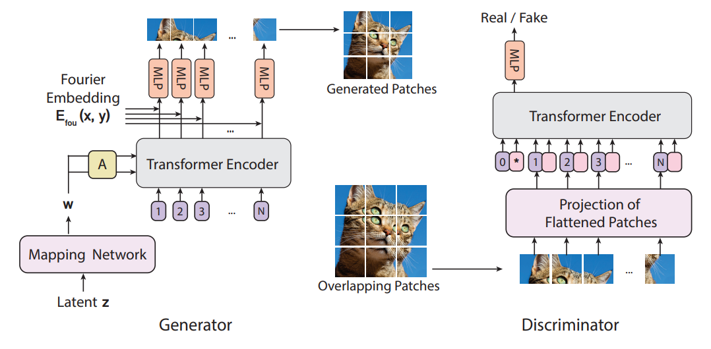

# ViTGAN

A modular Pytorch Implementation of ViTGAN based on https://arxiv.org/abs/2107.04589v1  
The goal of this projet is to provide a comprehensive framework to experiment with the ViTGAN architechture.

## Getting Started
The main file contains a simple example using MNIST, which can be trained relatively quickly. 
You can find the main hyper parameters of the model in the *config.json*. 
The *Core* folder contains the key consitutuants of the GAN model, while the *Components* folder contains more basic building blocks, but still implemented in a general way.

## Contributors
Lise Le Boudec, Paul Liautaud, Nicolas Olivain

## Key References
<a id="1" href="https://arxiv.org/abs/2107.04589">[1]</a> ViTGAN: Training GANs with Vision Transformers, Kwonjoon Lee, Huiwen Chang, Lu Jiang, Han Zhang, Zhuowen Tu, Ce Liu. Jul-2021  
<a id="2" href="https://arxiv.org/abs/2010.11929">[2]</a> An Image is Worth 16x16 Words: Transformers for Image Recognition at Scale, Alexey Dosovitskiy, Lucas Beyer, Alexander Kolesnikov, Dirk Weissenborn, Xiaohua Zhai, Thomas Unterthiner, Mostafa Dehghani, Matthias Minderer, Georg Heigold, Sylvain Gelly, Jakob Uszkoreit, Neil Houlsby Oct-2020  
<a id="3" href="https://arxiv.org/abs/2006.04710">[3]</a> The Lipschitz Constant of Self-Attention, Hyunjik Kim, George Papamakarios, Andriy Mnih Jun-2020  
<a id="4" href="https://arxiv.org/abs/1706.03762">[4]</a> Attention Is All You Need, Ashish Vaswani, Noam Shazeer, Niki Parmar, Jakob Uszkoreit, Llion Jones, Aidan N. Gomez, Lukasz Kaiser, Illia Polosukhin Jun-2017  
<a id="5" href="https://arxiv.org/abs/2107.04589v1">[5]</a> Generative Adversarial Networks, Ian J. Goodfellow, Jean Pouget-Abadie, Mehdi Mirza, Bing Xu, David Warde-Farley, Sherjil Ozair, Aaron Courville, Yoshua Bengio Jun-2014  

## See also
You can check https://github.com/wilile26811249/ViTGAN for a more minimalistic implementation.